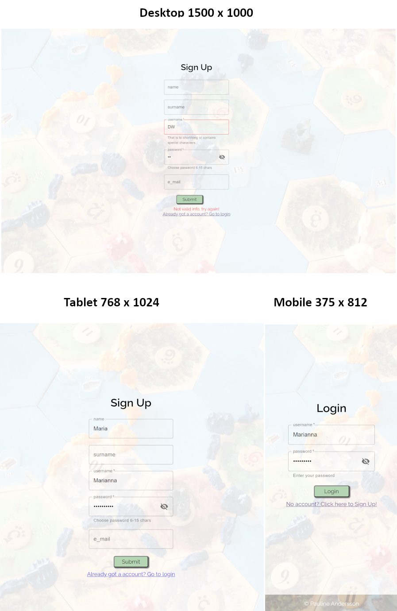
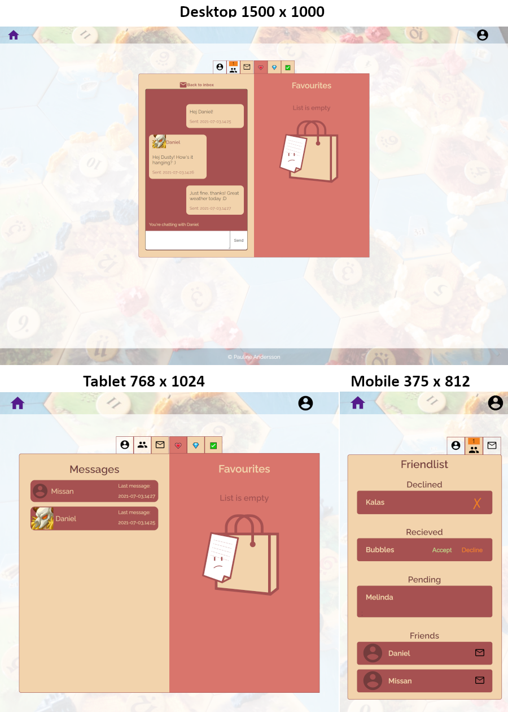

# Project
A boardgame community where the people with same interest can search in a extensive database of games, add to personal lists, message and make friends.

## Features

Public:
<ul>
    <li>Advanced search of games on parameters</li>
    <li>Search of games on input</li>
    <li>Filtering search results</li>
    <li>View detail gameinfo</li>
    <li>Search and view users</li>
    <li>Signup</li>
</ul>

Signed in:
<ul>
    <li>Add games to private lists</li>
    <li>Remove games from private lists</li>
    <li>Edit profile</li>
    <li>Add other users as friends</li>
    <li>Message friends</li>
    High-lights: 
<ul>
    <li>Games added to list will have a red heart in the bottom right corner when displayed in search</li>
    <li>When a new friend-request is sent to the user a notification symbol shows on the friends tab</li>
    <li>The user's pending, declined friends are not visible to other users</li>
    <li>The user's message tab and edit button is not visible to other users</li>
</ul>
</ul>

## Tech & Tools

### Tech: 
<ul>
    <li>JavaScript ES6</li>
    <li>React</li>
    <li>Redux</li>
    <li>React router</li>
    <li>Node express</li>
    <li>MongoDB / Mongoose</li>
    <li>Styled components</li>
    <li>Material ui</li>
</ul>

### Tools
<ul>
    <li>Postman</li>
    <li>VS Code</li>
    <li>MongoDB Compass</li>
    <li>Slack</li>
    <li>Stack Overflow</li>
    <li>Gimp</li>
</ul>

# Live

### frontend:
https://boarders-final.netlify.app/

### backend:
https://boarders-final-project.herokuapp.com/

# Media

# - Boardgames -

   
    

        <h2>Home</h2>
        
    

       
      

        <h2>Search & Filter</h2>
        
    

     
        

        <h2>Add Game (user specific)</h2>
        
    

 
 

# - Account - 

   
    

        <h2>Sign in/Sign up</h2>
        
    

       
      

        <h2>Profile and user gamelist</h2>
        
    

       
   

        <h2>Friends and messages</h2>
        
    

     
        

        <h2>Edit Profile</h2>
        
    

       

