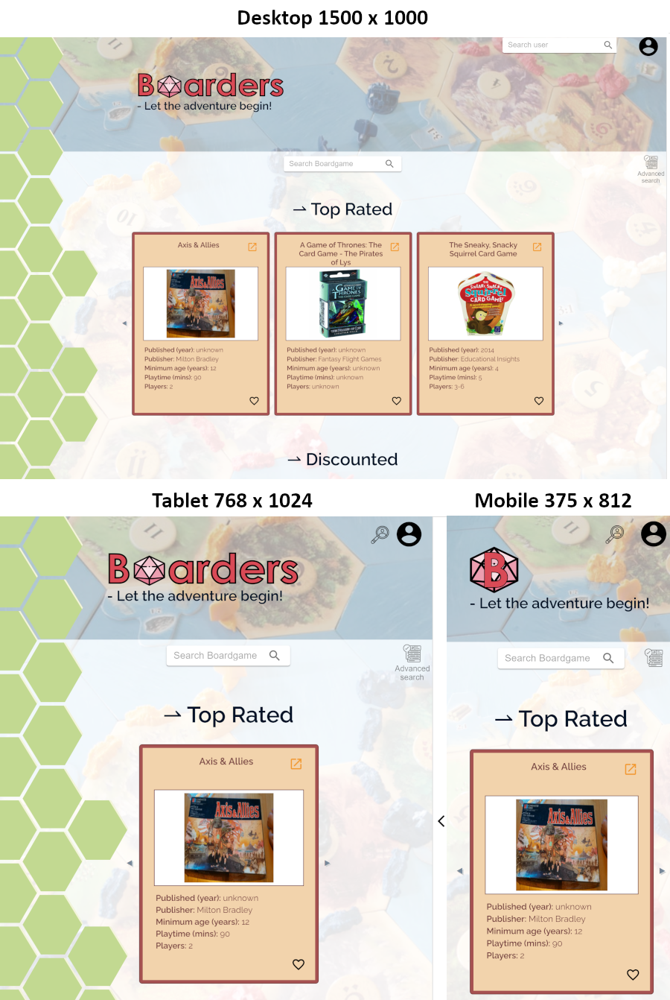
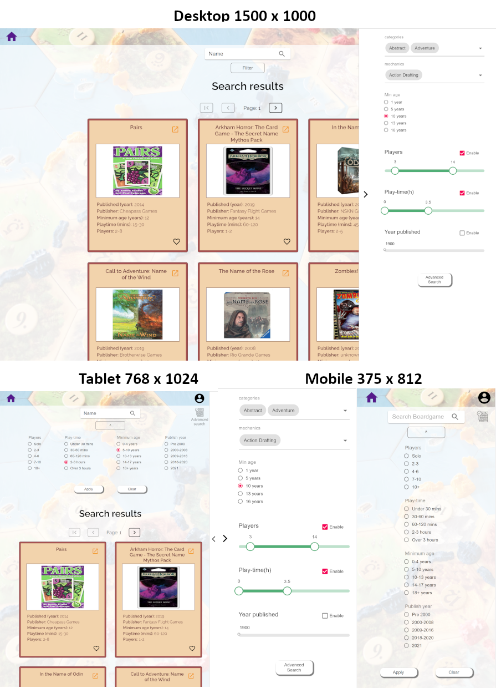
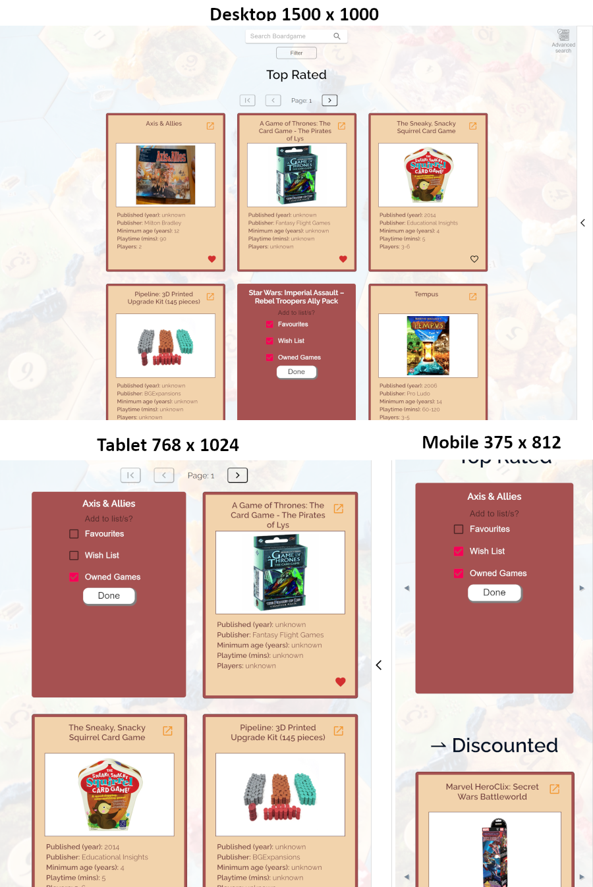
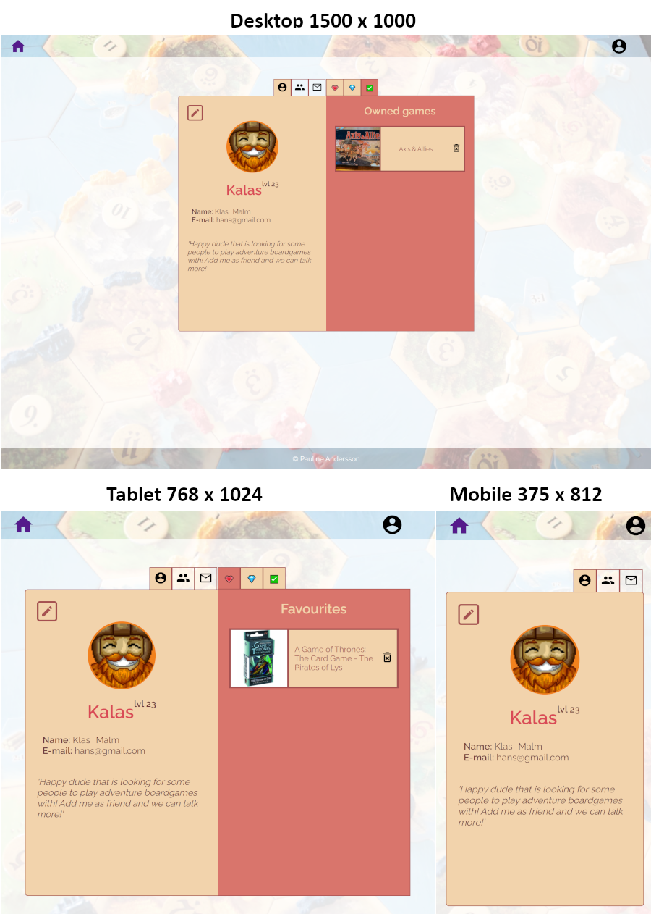
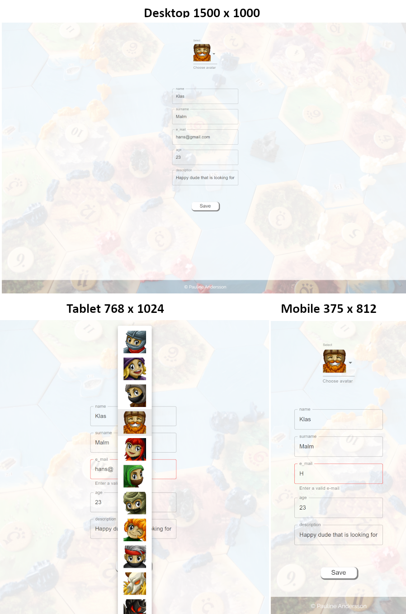

# Live

### frontend:
https://boarders-final.netlify.app/

### backend:
https://boarders-final-project.herokuapp.com/

# Media

# - Boardgames -

   
    

        <h2>Home</h2>
        
    

       
      

        <h2>Search & Filter</h2>
        
    

     
        

        <h2>Add Game (user specific)</h2>
        
    

 
 

# - Account - 

<!-- 

   
    

        <h2>Sign in/Sign up</h2>
        
    

       
      

        <h2>Profile and user gamelist</h2>
        
    

       
    

        <h2>Friends</h2>
        
    

       
    

        <h2>Messages</h2>
        
    

     
        

        <h2>Edit Profile</h2>
        
    

       

 -->

